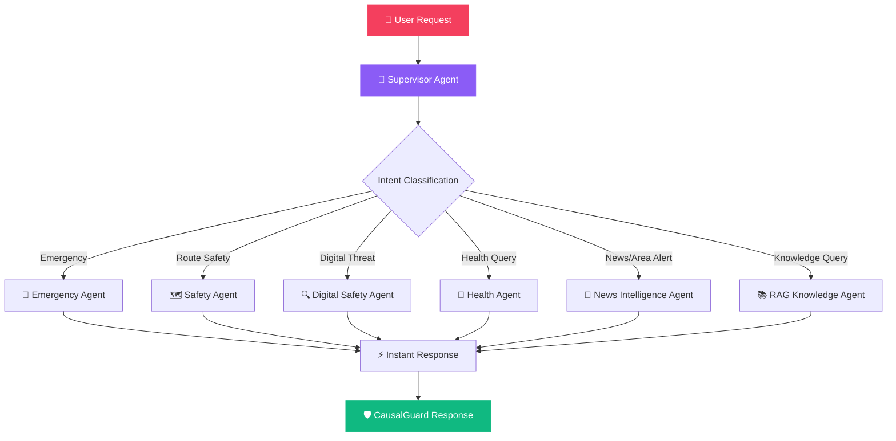

<div align="center">

<!-- Animated Header -->


<br/>

<!-- Badges -->


<br/>

<!-- Animated typing -->
<a href="https://git.io/typing-svg"></a>

<br/>


</div>

---

## 💔 The Reality We Can't Ignore

<div align="center">

> *"A crime against a woman is reported every **4 minutes** in India."*  
> — National Crime Records Bureau (NCRB), 2023

</div>

**4,45,256 cases** of crimes against women registered in a single year. Stalking on empty streets. Harassment in crowded buses. Chain snatching near underpasses. Auto drivers deviating from routes at midnight. Threatening messages from unknown numbers.

Behind every statistic is a **real woman** — a daughter walking home from tuition, a working professional catching a late-night cab, a college student navigating a dimly lit campus.

**We built CausalGuard because "just call 100" is not enough.**

CausalGuard doesn't wait for danger to strike. It **predicts**, **prevents**, and **protects** — with AI that understands fear in your voice, routes that avoid dark alleys, and a guardian network that watches over you with your consent.

<div align="center">

</div>

---

## 🛡️ What is CausalGuard?

**CausalGuard** is a full-stack, AI-first women safety companion purpose-built for the Indian context. It goes far beyond a panic button — it's an intelligent safety ecosystem powered by **6 specialized AI agents**, **8 Indian languages**, and a **privacy-first architecture** that ensures your data stays yours.

```
🎯 Prevention-First    →  Don't wait for danger. Predict and avoid it.
🧠 AI-Powered          →  Google Gemini + 6 specialized agents working together.
🗣️ Voice-First         →  Say "बचाओ" and help arrives. No buttons needed.
🔒 Privacy-Preserved   →  Your location, your consent, your control. Always.
📡 100% Uptime         →  Every critical feature works offline with smart fallbacks.
```

<div align="center">

</div>

---

## 🧠 Multi-Agent AI Architecture

CausalGuard doesn't run on a single AI model — it orchestrates a **team of 6 specialized agents**, each an expert in their domain, coordinated by an intelligent Supervisor.



| Agent | Role | Superpower |
|:---:|:---|:---|
| 🎯 **Supervisor** | Intent classification & agent routing | Decides which agents to activate in < 100ms |
| 🚨 **Emergency** | SOS triggers, guardian alerts, police dispatch | Instant-fire — never blocked by other agents |
| 🗺️ **Safety** | Route risk scoring, safe path recommendations | Weighs lighting, crowds, police proximity, news signals |
| 🔍 **Digital Safety** | Harassment detection in messages/chats | Classifies: Safe → Suspicious → Harassment → Threatening |
| 🏥 **Health** | Period/pregnancy-aware routing | Re-weights routes near pharmacies, hospitals, rest points |
| 📰 **News Intel** | Live area caution signals from news feeds | Temporary neighborhood alerts, not static crime data |
| 📚 **RAG Knowledge** | Legal resources, helplines, safety guidelines | LlamaIndex-powered retrieval from curated Indian safety docs |

> **💡 100% Uptime Guarantee:** Every agent has a deterministic rule-based fallback. If Gemini is down, if the internet is off, if the API key is missing — **CausalGuard still works.** Safety features never fail.

---

## ✨ Features — Every Detail Matters When Safety Is At Stake

<div align="center">

</div>

### 🗺️ Safe Route Navigation

> *"The safest route home isn't always the shortest one."*

- **OSRM-powered real-time routing** — not Google Maps directions, but actual road geometry analysis
- Routes scored on **6 safety parameters**: street lighting, crowd density, police station proximity, hospital distance, news caution signals, and time-of-day risk
- **Safest vs Shortest route comparison** with visual risk scores on the map
- **Leaflet.js dark-mode maps** with live polyline rendering
- **News-based caution overlays** — if a snatching was reported near Shivajinagar yesterday, that route gets flagged today

---

### 🆘 SOS Emergency System

> *"When seconds matter, CausalGuard responds in milliseconds."*

- **One-tap SOS** that instantly:
  - 📍 Captures GPS coordinates
  - 🚔 Dispatches alert to police dashboard
  - 👨‍👩‍👧 Notifies all trusted guardians
  - 📁 Auto-saves location evidence to Evidence Locker
- **10-second auto-escalation** — if you don't respond to "Are you safe?", SOS triggers automatically
- **Pre-filled SMS intents** with live Google Maps links for guardians
- Works even without pressing any button — voice or timer-triggered

---

### 🎙️ Multilingual Voice Assistant

> *"Safety shouldn't have a language barrier."*

**8 Indian languages supported:**

| Language | SOS Trigger Words | Script |
|:---|:---|:---:|
| 🇬🇧 English | "help", "emergency", "save me" | Latin |
| 🇮🇳 Hindi | "बचाओ", "खतरा", "मदद" | देवनागरी |
| 🇮🇳 Tamil | "காப்பாற்றுங்கள்", "உதவி" | தமிழ் |
| 🇮🇳 Telugu | "కాపాడండి", "ఆపద" | తెలుగు |
| 🇮🇳 Kannada | "ಕಾಪಾಡಿ", "ಅಪಾಯ" | ಕನ್ನಡ |
| 🇮🇳 Malayalam | "രക്ഷിക്കൂ", "സഹായം" | മലയാളം |
| 🇮🇳 Marathi | "वाचवा", "धोका" | मराठी |
| 🇮🇳 Bengali | "বাঁচাও", "বিপদ" | বাংলা |

- Voice commands for: SOS, Fake Call, Safe Route, Cab Safety, Health Mode
- **Web Speech API integration** for real-time speech recognition
- Text-to-speech responses in the user's preferred language

---

### 📞 Fake Call Simulation

> *"Sometimes the safest escape is a phone ringing."*

- Instantly simulates a realistic incoming call from "Mom"
- **Voice playback on answer**: *"Hello Anya, I am tracking your auto right now. Keep talking to me."*
- Designed as a **discreet de-escalation tool** — look busy, feel safe
- Triggerable via voice command: *"Start fake call"* or *"फर्जी कॉल"*

---

### 👨‍👩‍👧 Guardian Trust Network

> *"Protection with consent. Tracking with trust."*

- **Invite guardians** via secure 6-character alphanumeric codes
- **Granular permission levels** — you decide what guardians can see:

| Permission | What Guardian Sees |
|:---|:---|
| `No Access` | Nothing — guardian is linked but blocked |
| `SOS-only` | Notified only during active SOS emergencies |
| `Journey-only` | Can view your active journey route & location |
| `Temp-30m` | Temporary 30-minute location sharing window |
| `One-time` | Single journey tracking, auto-revokes after |
| `Always-on` | Full real-time tracking (consent-revocable anytime) |

- **Guardian Dashboard** with live journey monitoring for approved wards
- Permission can be revoked by the woman **at any time, instantly**

---

### 🚖 Cab & Auto Safety

> *"Because 'I'll share my live location' shouldn't be your only safety plan."*

- **Log vehicle details** — number plate, driver name, cab type
- **Live route tracking** against expected OSRM polyline
- **Real-time deviation detection** — if the cab drifts > 500m from the planned route, a safety verification triggers immediately
- **Auto-evidence logging** — every ride is saved to Evidence Locker with vehicle details, timestamps, and route data
- Voice command: *"Track my cab"* or *"ऑटो ट्रैक करो"*

---

### 🔍 Digital Safety & Harassment Detection

> *"Online threats are real threats."*

- Paste any suspicious message, chat screenshot, or text block
- AI classifies into 4 threat levels:
  - ✅ **Safe** — No indicators of harassment
  - ⚠️ **Suspicious** — Potential red flags detected
  - 🟠 **Harassment** — Clear harassment pattern identified
  - 🔴 **Threatening** — Immediate danger indicators
- **Actionable recommendations**: Block sender, screenshot for evidence, report to cybercrime.gov.in
- Direct integration with **Evidence Locker** for legal documentation

---

### 🏥 Health-Aware Safety Routing

> *"Your body's needs shouldn't be an afterthought during a commute."*

- **Period Discomfort Mode** — re-weights routes closer to pharmacies, rest areas, and flat terrain
- **Pregnancy Safety Mode** — maximizes hospital proximity (within 500m), avoids construction zones and unpaved streets
- **Medicine reminders** — set and track medication schedules
- Nearby healthcare facility finder with distance calculations

> ⚕️ *Disclaimer: CausalGuard provides well-being support, not medical diagnosis. For medical emergencies, contact a doctor or emergency service.*

---

### 🏫 Campus Safety Mode

> *"College campuses at 10 PM shouldn't feel like danger zones."*

- Area-specific safety check-ins for students
- Designed for navigating campuses during odd hours
- Integrates with the broader safe route and guardian system

---

### 📰 News Intelligence Engine

> *"Yesterday's incident shapes today's safe route."*

- **Live news ingestion** via NewsAPI — real India-centric safety feeds
- **Gemini-powered classification** of news articles into location + severity
- **Temporary caution signals** — not permanent crime labels, but live neighborhood awareness
- Pune-specific location mapping with 14+ geo-tagged neighborhoods
- Manual refresh capability for latest safety intelligence

---

### 🎤 Voice Emotion & Risk Analysis

> *"Your voice reveals what words sometimes can't."*

- Analyzes spoken transcripts for emotional distress indicators:
  - 😰 **Fear Score** (0-100)
  - 😟 **Anxiety Score** (0-100)
  - 😣 **Stress Score** (0-100)
  - 😌 **Calm Score** (0-100)
- **Composite Voice Risk Score** with weighted formula
- Auto-triggers:
  - Risk > 60 → **Safety verification check**
  - Risk > 80 → **SOS preparation mode**
- Supports keyword detection in Hindi, Tamil, and English

---

### 📁 Evidence Locker

> *"When the time comes, evidence shouldn't be 'I think it happened near...' "*

- **Encrypted local storage** for:
  - 📸 Screenshots of threatening messages
  - 🗺️ GPS route logs with timestamps
  - 🚖 Vehicle details and ride records
  - 📝 Incident descriptions and notes
- **Consent-controlled** — only the woman can access, create, or delete evidence
- Ready for legal or police reporting purposes
- Auto-populated during SOS and cab safety events

---

### 🔒 Privacy-First Architecture

> *"Your safety data is YOUR data. Period."*

- **Consent-driven** — location sharing only during SOS or active journeys
- **Configurable settings**:
  - Share location SOS-only ✅
  - Enable safe word ✅
  - Store evidence locally only ✅
  - Anonymize feedback for community learning ✅
- **Journey history purge** — delete all completed journey logs instantly
- **No raw ID storage** — government IDs are masked after verification (`12****12`)
- Community feedback is **anonymized** before aggregation

---

### 📊 Police Dashboard

> *"First responders need real-time intelligence, not phone calls."*

- Dedicated dispatcher interface for law enforcement
- Real-time SOS and protection request alerts with:
  - User name and phone number
  - GPS coordinates with map link
  - Risk score and route details
  - Timestamp and alert type
- Alert status tracking: `New` → `Viewed` → `Responding` → `Resolved`

---

### 🧠 Continual Learning System

> *"CausalGuard gets smarter with every journey."*

- **Post-journey feedback** — rate route safety, flag inaccurate risk scores
- **Community signals** — anonymized, federated safety intelligence
- Risk model recalibration based on user-reported ground truth
- Sector-specific risk weight adjustments from community input
- **Zero personal data exposure** — coordinates stay private, only patterns are shared

---

### 🔗 RAG Knowledge Base

> *"The right information at the right time can save a life."*

- **LlamaIndex-powered** retrieval-augmented generation
- Curated knowledge base covering:
  - Women safety guidelines for India
  - Emergency procedures and helpline directories
  - Cybercrime reporting workflows
  - Legal resources and rights awareness
  - Self-defense awareness materials
  - Health safety resources
  - Campus safety policies
  - Privacy and consent policies

---

<div align="center">

</div>

## 🏗️ System Architecture

```
CausalGuard/
├── 🔧 backend/                      # FastAPI Python Application
│   ├── main.py                      # API Entry Point, Lifespan & CORS
│   ├── config.py                    # Pydantic Settings & Environment Config
│   ├── database.py                  # SQLAlchemy ORM Models (18 tables)
│   ├── schemas.py                   # Pydantic Request/Response Schemas
│   ├── auth.py                      # JWT Auth + bcrypt Password Hashing
│   ├── verification.py              # Simulated Government ID KYC
│   │
│   ├── 🧠 agents/                   # Multi-Agent AI System
│   │   ├── graph.py                 # FallbackGraph — Agent Orchestrator
│   │   ├── supervisor_agent.py      # Intent Classification & Routing
│   │   ├── safety_agent.py          # Route Safety Analysis
│   │   ├── emergency_agent.py       # SOS & Emergency Response
│   │   ├── digital_safety_agent.py  # Online Harassment Detection
│   │   ├── health_agent.py          # Health-Aware Routing
│   │   ├── news_agent.py            # News Intelligence Processing
│   │   ├── rag_agent.py             # LlamaIndex RAG Engine
│   │   └── state.py                 # AgentState TypedDict Definition
│   │
│   ├── 🗣️ voice/                    # Voice Processing
│   │   ├── intent_parser.py         # Multilingual Command Parser
│   │   ├── whisper_engine.py        # OpenAI Whisper STT (Optional)
│   │   └── tts.py                   # Text-to-Speech Engine (Optional)
│   │
│   ├── 🤖 llm/                      # LLM Integration
│   │   └── gemini_client.py         # Gemini API + Rule-Based Fallbacks
│   │
│   ├── 📡 Core Modules
│   │   ├── journey.py               # OSRM Routing & GPS Tracking
│   │   ├── route_risk.py            # Risk Scoring Engine
│   │   ├── sos.py                   # SOS Alerts & Auto-Escalation
│   │   ├── guardians.py             # Guardian Trust Network
│   │   ├── cab_safety.py            # Vehicle Monitoring & Deviation
│   │   ├── voice_assistant.py       # 8-Language Voice Commands
│   │   ├── voice_risk_analysis.py   # Emotion & Stress Detection
│   │   ├── news_intelligence.py     # Live News Caution Signals
│   │   ├── health_safety.py         # Health Mode & Reminders
│   │   ├── digital_safety.py        # Harassment Classification
│   │   ├── harassment_detection.py  # Gemini Threat Analysis
│   │   ├── evidence_locker.py       # Encrypted Evidence Storage
│   │   ├── privacy.py              # Consent & Data Purge
│   │   ├── emotional_safety.py     # Mood & Stress Check-ins
│   │   ├── feedback_learning.py    # Community Learning
│   │   ├── police_dashboard.py     # Law Enforcement Dashboard
│   │   └── explanation_engine.py   # Causal Risk Explanations
│   │
│   └── 📚 knowledge_base/          # RAG Source Documents
│
├── 🎨 frontend/                     # Vite React SPA
│   ├── src/
│   │   ├── api/index.ts            # Unified API Client
│   │   ├── services/               # Location & Speech Services
│   │   ├── pages/                  # 18+ Dashboard & Safety Pages
│   │   ├── App.tsx                 # Router, Modals & Emergency Banners
│   │   └── index.css               # Dark Theme & Leaflet Styling
│   ├── tailwind.config.js
│   └── vite.config.ts
│
├── requirements.txt                 # Python Dependencies
├── .env.example                     # Environment Template
└── README.md                        # You are here 📍
```

---

## 🛠️ Tech Stack

<div align="center">

| Layer | Technology | Purpose |
|:---:|:---|:---|
| 🔧 **Backend** | FastAPI + Python 3.11 | High-performance async API server |
| 🧠 **AI/LLM** | Google Gemini 2.0 Flash | Intent classification, threat analysis, emotion detection |
| 📚 **RAG** | LlamaIndex + HuggingFace Embeddings | Knowledge retrieval from safety guidelines |
| 🗄️ **Database** | SQLAlchemy + SQLite | 18-table relational schema with ORM |
| 🔐 **Auth** | JWT + bcrypt | Secure token-based authentication |
| 🎨 **Frontend** | React 18 + TypeScript + Vite | Responsive SPA with dark theme |
| 🎨 **Styling** | Tailwind CSS + Custom CSS | Premium glassmorphism dark UI |
| 🗺️ **Maps** | Leaflet.js + OSRM | Real-time route rendering & navigation |
| 🗣️ **Voice** | Web Speech API | Browser-native speech recognition & synthesis |
| 📰 **News** | NewsAPI.org | Live India-centric safety news feeds |

</div>

---

## 🚀 Quick Start

### Prerequisites
- Python 3.11+
- Node.js 18+
- npm or yarn

### 1. Clone & Configure

```bash
# Clone the repository
git clone https://github.com/Madhav2246/CausalGuard-Women-Safety-Comapnion.git
cd CausalGuard-Women-Safety-Comapnion

# Create environment file
cp .env.example .env
```

Edit `.env` with your API keys:
```env
GEMINI_API_KEY=your_gemini_api_key_here
NEWS_API_KEY=your_news_api_key_here
USE_GEMINI=true
USE_NEWS_API=true
USE_OSRM=true
```

### 2. Backend Setup

```bash
# Create virtual environment
python -m venv venv

# Activate (Windows)
venv\Scripts\activate

# Activate (Mac/Linux)
source venv/bin/activate

# Install dependencies
pip install -r requirements.txt

# Launch the server
cd backend
uvicorn main:app --reload
```

> 🌐 Backend runs at **http://localhost:8000**  
> 📄 API Docs at **http://localhost:8000/docs**

### 3. Frontend Setup

```bash
# In a new terminal, from root directory
cd frontend
npm install
npm run dev
```

> 🎨 Frontend runs at **http://localhost:5173**

### 4. Demo Accounts

| Role | Email | Password |
|:---|:---|:---|
| 👩 Woman | `anya@mail.com` | `password123` |
| 👨 Guardian | `guardian@mail.com` | `password123` |
| 👮 Police | `dispatcher@mail.com` | `password123` |

---

## 🎬 Demo Flow

```
1️⃣  Login as Woman → Complete KYC verification
2️⃣  Plan Safe Commute → Compare Safest vs Shortest routes on the map
3️⃣  Start Journey → Voice safety monitor activates every 45s
4️⃣  Say "I feel unsafe" → Voice risk engine detects high fear/stress
5️⃣  "Are You Safe?" modal → 10-second countdown to auto-SOS
6️⃣  SOS triggers → GPS captured, guardians alerted, police notified
7️⃣  Cab Safety → Start monitoring, simulate deviation → alarm triggers
8️⃣  Evidence Locker → View auto-saved ride details and GPS logs
9️⃣  End Journey → Submit feedback → Community risk model updates
🔟  AI Trace → View supervisor routing decisions and agent outputs
```

---

## 🤝 Contributing

We welcome contributions that make women safer. Whether it's adding a new Indian language, improving the risk algorithm, or fixing a bug — every line of code matters.

```bash
# Fork → Clone → Branch → Code → Push → PR
git checkout -b feature/your-feature-name
```

---

## 📜 License

This project is licensed under the **MIT License** — see the [LICENSE](LICENSE) file for details.

---

<div align="center">


### 💜 Built with purpose. Built with heart.

*CausalGuard was built with the belief that technology should serve as a shield for those who need it most. Every feature, every fallback, every line of code exists because somewhere, someone is walking home alone at night — and they deserve to feel safe.*

<br/>

**If this project resonated with you, give it a ⭐ — not for us, but for every woman who deserves to reach home safe.**

<br/>


<br/>


</div>
